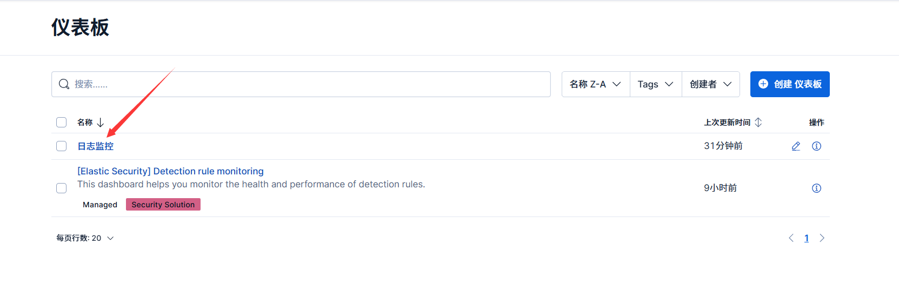
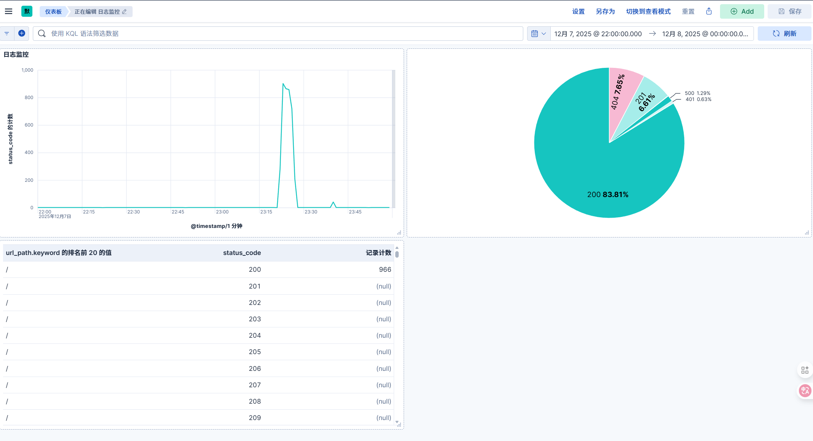

## 📊 项目概述

本Kibana仪表盘是一个**Web应用实时监控系统**，基于完整的ELK技术栈（Elasticsearch、Logstash、Filebeat、Kibana）构建。它能自动收集、解析和可视化Web应用的日志数据，提供实时业务监控和故障排查能力。

**核心价值**：只需访问一个URL，即可掌握应用健康状况、流量趋势和错误详情，无需登录多台服务器查看日志文件。

---

## 🚀 快速访问

### 仪表盘主界面




---

## 📈 仪表盘功能详解

### 1. 实时请求量趋势图（折线图）
**功能**：
- 展示应用每秒请求量（QPS）随时间的变化趋势
- 实时反映流量高峰和低谷时段
- 自动每10秒刷新，实现准实时监控
**关键指标**：请求计数、时间分布

### 2. HTTP状态码分布图（饼图/圆环图）
**功能**：
- 直观展示各类HTTP状态码的比例分布
- 快速识别错误请求（4xx、5xx）占比
- 点击任意色块可联动筛选其他图表
**关键字段**：`status_code` (200, 404, 500等)

### 3. 错误详情分析表（数据表）
**功能**：
- 列出具体出错的接口路径和错误类型
- 按错误数量排序，快速定位问题最严重的接口
- 支持两级下钻：接口路径 → 具体状态码
**关键字段**：`url_path`、`status_code`、错误计数

---

## 🔧 核心功能操作指南

### 时间范围筛选
1.  在仪表盘右上角找到时间选择器（默认显示“过去15分钟”）
2.  点击可选择预设范围（“今天”、“本周”、“过去1小时”等）
3.  或选择“绝对时间”手动输入精确时间范围

### 自动刷新设置
1.  仪表盘已预设**每10秒自动刷新**
2.  如需调整：点击右上角“自动刷新”按钮
3.  选择新间隔（5秒、30秒、1分钟等）或暂停自动刷新

### 图表交互与下钻
- **联动筛选**：点击饼图中特定状态码，其他图表会只显示该状态码的数据
- **查看详情**：点击数据表中的行，可在下方查看该错误的详细日志
- **重置视图**：点击任意图表的“点击筛选”提示或刷新页面可重置所有筛选

### 字段搜索与筛选
1.  在Discover页面（左侧导航栏可进入）
2.  使用KQL查询语法进行高级筛选，例如：
    - `status_code:500` - 只看服务器错误
    - `response_time_ms:>1000` - 查找慢请求
    - `level:ERROR AND url_path:/api/*` - API接口错误

---

## 🛠 数据源与字段说明

### 数据来源
- **应用日志**：`elk-web-app`容器输出的结构化JSON日志
- **访问日志**：Gunicorn服务器标准的Nginx样式访问日志
- **处理管道**：Filebeat收集 → Logstash解析 → Elasticsearch存储

### 关键字段参考
| 字段名 | 类型 | 说明 | 示例 |
| :--- | :--- | :--- | :--- |
| `@timestamp` | 日期 | 日志处理时间 | 2025-12-07T08:01:07.653Z |
| `status_code` | 整数 | HTTP响应状态码 | 200, 404, 500 |
| `level` | 字符串 | 日志级别 | INFO, WARNING, ERROR |
| `url_path` | 字符串 | 请求路径 | `/api/user/123` |
| `http_method` | 字符串 | HTTP方法 | GET, POST |
| `response_time_ms` | 浮点数 | 响应时间（毫秒） | 45.32 |
| `client_ip` | IP地址 | 客户端IP | 192.168.1.100 |

---

## 🔍 常见监控场景

### 场景一：日常健康检查
1.  打开仪表盘，查看饼图中绿色部分（2xx状态码）是否占主导
2.  确认折线图显示正常的请求波动，无突然骤降
3.  检查错误详情表是否为空或只有少量已知低优先级错误

### 场景二：故障应急响应
1.  发现饼图中红色（5xx）比例突然增加
2.  立即查看错误详情表，找到错误数量最多的接口
3.  根据`url_path`和`status_code`定位具体问题接口
4.  使用时间选择器查看故障开始时间，关联部署或变更记录

### 场景三：性能优化分析
1.  在Discover页面搜索：`response_time_ms:>1000`
2.  找出慢请求，分析其`url_path`模式
3.  结合`@timestamp`查看慢请求是否集中在特定时段

---

## ⚠️ 故障排查指南

### 仪表盘无数据？
1.  **检查服务状态**：
    ```bash
    docker-compose ps
    ```
    确认所有服务状态为“Up”
2.  **检查数据流水线**：
    - 访问 http://localhost:8000/health 生成测试日志
    - 检查Filebeat日志：`docker-compose logs filebeat`
    - 检查Logstash处理：`docker-compose logs logstash`
3.  **调整时间范围**：
    - 确保仪表盘时间范围包含日志产生时间
    - 尝试选择“今天”或“过去24小时”
4.  **【新增】检查索引模式**：确认Kibana中已创建名为 `webapp-*` 的索引模式（数据视图）。

### 图表显示异常？
1.  **字段显示问题**：
    - 在Discover页面验证字段是否存在
    - 检查字段名拼写是否正确（如`status_code`不是`status`）
2.  **可视化配置问题**：
    - 点击图表右上角菜单，选择“编辑”
    - 检查字段映射是否正确
    - 确认聚合方式（计数、平均值等）符合预期
3.  **【新增】配置导入失败**：确保导入`.ndjson`文件前，相关索引模式已存在。

---

## 📁 **【更新】项目结构说明**

```
SimpleELK/
├── docker-compose.yml          # 所有服务的容器编排配置
├── kibana/
│   ├── kibana.yml             # Kibana主配置文件
│   └── saved_objects/         # 【新增】Kibana已保存对象配置
│       └── web_app_monitoring_dashboard.ndjson  # 仪表盘配置文件
├── logstash/
│   ├── config/logstash.yml    # Logstash主配置
│   └── pipeline/docker-logs.conf  # 日志处理管道（核心解析逻辑）
├── filebeat/filebeat.yml      # 日志收集器配置
├── elasticsearch/elasticsearch.yml # 搜索引擎配置
└── web-app/                   # 示例Web应用（日志源）
    ├── app.py                 # Flask应用
    └── stress_test.py         # 压力测试脚本
```

---

## 🚨 重要提醒

1.  **数据保留策略**：当前索引按日期分割（如`webapp-logs-info-2025.12.07`），默认保留所有数据。生产环境应通过Elasticsearch索引生命周期管理（ILM）策略自动清理旧数据。
2.  **安全注意事项**：
    - 当前配置为开发环境，安全功能（xpack.security）已禁用
    - 生产部署前必须启用密码认证和HTTPS
    - 限制可访问Kibana的IP范围
3.  **性能监控**：
    - 监控Elasticsearch集群健康状态：`curl http://localhost:9200/_cluster/health`
    - 定期检查磁盘空间，确保有足够空间存储日志
4.  **【增强】配置备份策略**：
    - 仪表盘配置已作为`.ndjson`文件纳入版本控制
    - 对仪表盘的任何修改，都可通过导出功能更新此文件，实现配置变更的历史追溯。

---

## 📞 支持与反馈

如果在使用过程中遇到问题：

1.  **检查日志**：`docker-compose logs -f [服务名]`
2.  **验证数据流**：按“应用 → Filebeat → Logstash → ES → Kibana”顺序排查
3.  **查阅文档**：[Elastic官方文档](https://www.elastic.co/guide/index.html)
4.  **重置环境**：如需从头开始，可运行 `./cleanup.sh`（谨慎操作，会删除数据）

---
